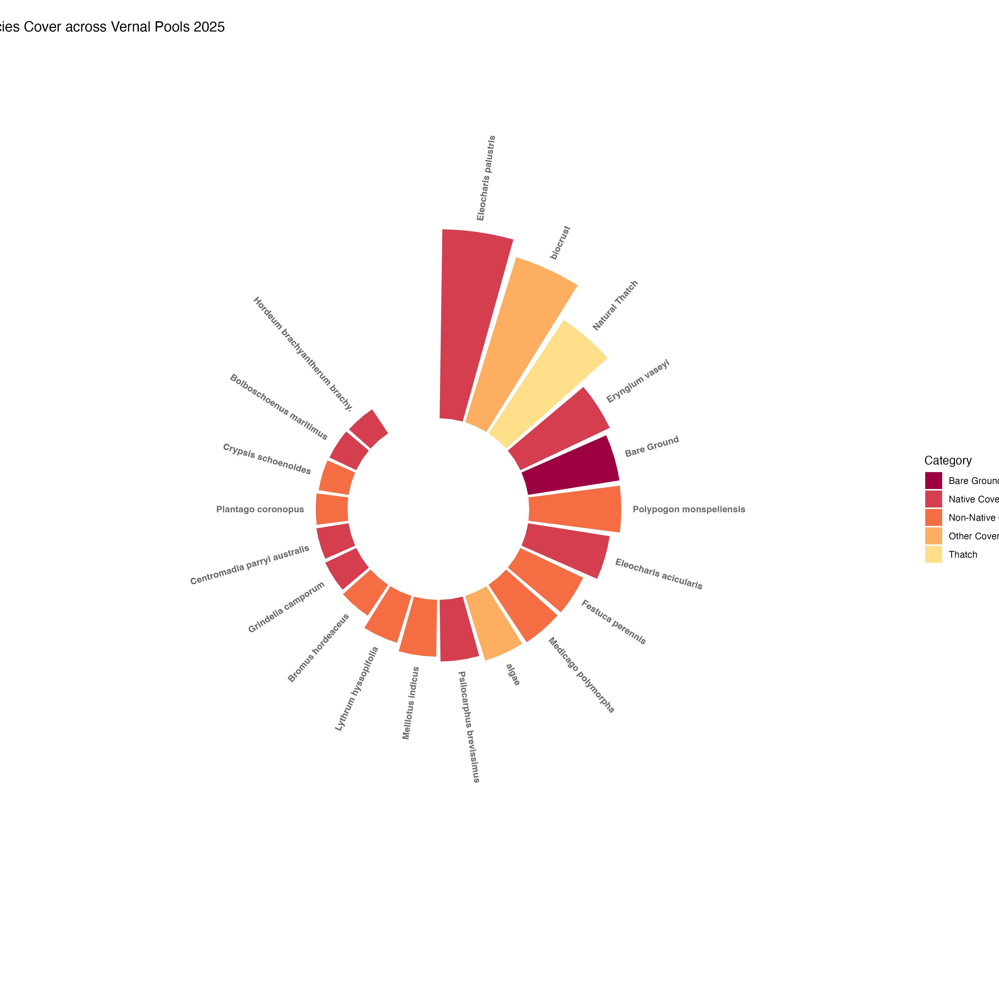

# Intermediate Elective
## General information
This repository contains data and code to explore patterns in vegetation 
cover across vernal pools at North Campus Open Space (NCOS) in 2025.

To work with the code in this repository, you will need the following packages:
```
library(tidyverse)
library(here)
library(janitor)
library(snakecase)
library(NatParksPalettes)
library(RColorBrewer)
library(readxl)
library(scales)
library(naniar)
library(patchwork)
```

## Data and file information
```
.
├── README.md
├── code                                          
│   ├── Intermediate_Elective_2.pdf        # rendered output
│   └── Intermediate_Elective_2.qmd        # main analysis and figure code
├── data
│   ├── veg.csv                            # vegetation survey data
│   └── vp_veg_metadata.csv               # vegetation survey metadata
└── figures
    └── percentcover.png                   # final figure output
```

## Rendered output
The rendered document is here [View PDF](code/Intermediate_elective_2.pdf).

## Final Figure


